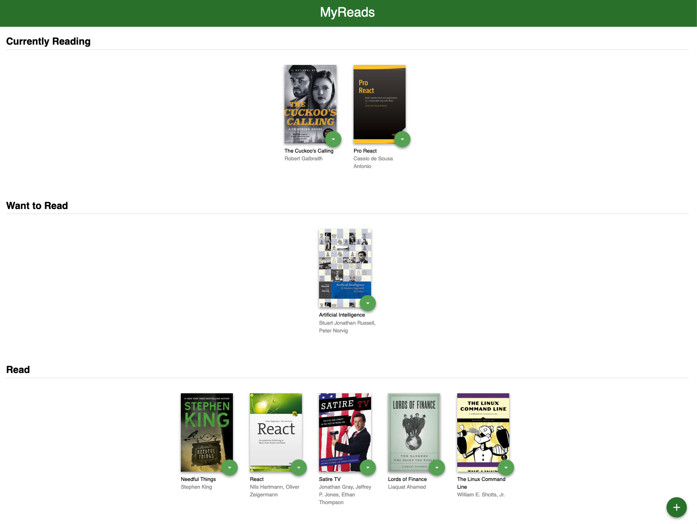
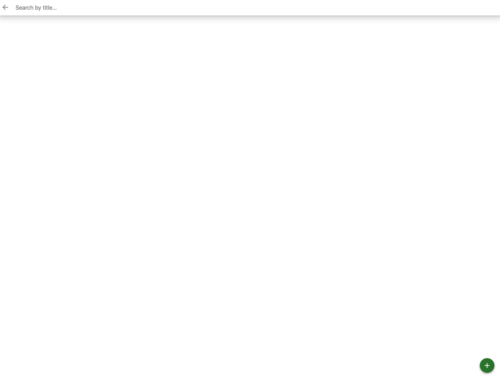

# MyReads: A Book Lending App

## Project Overview
MyReads is a bookshelf application that allows you to select and categorize books you have read, are currently reading, or want to read. The project emphasizes using React to build the application and provides an API server and client library that you will use to persist information as you interact with the application.

## Screenshots

1. Home Page


2. Search Page


3. Search Page


## Features
- Search for books and add them to your shelf
- Move books between shelves
- View the names of the authors

## Getting Started

1. Clone the repository:

```bash
git clone [your-repo-link]
```


2. Navigate to the directory where the repository has been cloned, and install the dependencies: 

```bash
cd myreads
npm install
```

3. Start the application: 

```bash
npm start
```

This will open a new browser tab/window with the application running. Kindly refer to the terminal to look for the local URL. 